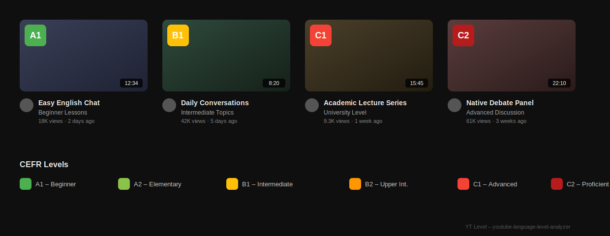
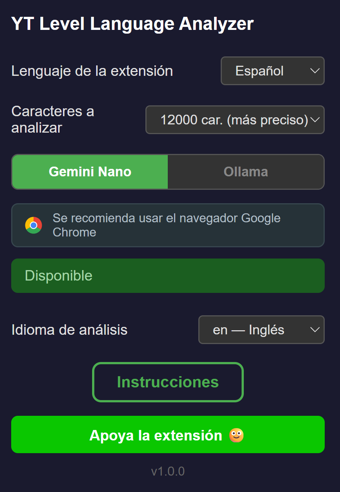
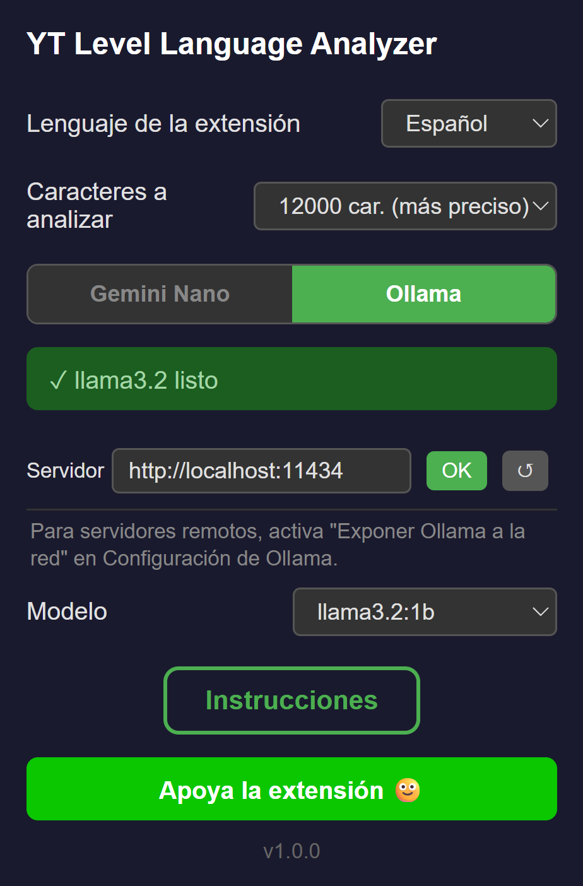

<div align="center">
  
  <h1>YT Level</h1>
  <p><strong>YouTube भाषा स्तर विश्लेषक</strong></p>
  <p>स्थानीय AI का उपयोग करके किसी भी YouTube वीडियो के CEFR स्तर (A1–C2) का विश्लेषण करें — कोई API कुंजी नहीं, कोई इंटरनेट आवश्यक नहीं।</p>
  <p>दो AI इंजनों में से चुनें: <strong>Gemini Nano</strong> (Chrome में निर्मित) या <strong>Ollama</strong> (स्थानीय सर्वर)। <strong>किसी भी भाषा</strong> के लिए काम करता है।</p>
</div>

---

**🌐 भाषा**

[🇬🇧 English](README.md) · [🇪🇸 Español](README.es.md) · [🇫🇷 Français](README.fr.md) · [🇵🇹 Português](README.pt.md) · [🇩🇪 Deutsch](README.de.md) · [🇮🇹 Italiano](README.it.md) · [🇨🇳 中文](README.zh.md) · [🇯🇵 日本語](README.ja.md) · [🇰🇷 한국어](README.ko.md) · [🇸🇦 العربية](README.ar.md) · [🇮🇳 हिन्दी](README.hi.md) · [🇷🇺 Русский](README.ru.md)

---

## इंस्टॉल करें

<div align="center">
  <a href="#" style="display:inline-block;padding:12px 32px;background:#4CAF50;color:#fff;border-radius:8px;text-decoration:none;font-weight:bold;font-size:16px;">Chrome Web Store पर उपलब्ध</a>
</div>

> इंस्टॉल होने के बाद, एक्सटेंशन YouTube पर स्वचालित रूप से काम करता है। कॉन्फ़िगर करने के लिए एक्सटेंशन आइकन पर क्लिक करें।

---

## स्क्रीनशॉट

<p align="center">
  
  <br>
  <em>YouTube वीडियो थंबनेल पर दिखाए गए CEFR स्तर बैज (A1-C2)</em>
</p>

<p align="center">
  
  <br>
  <em>एक्सटेंशन पॉपअप — Gemini Nano टैब</em>
</p>

<p align="center">
  
  <br>
  <em>एक्सटेंशन पॉपअप — Ollama टैब</em>
</p>

---

## विशेषताएँ

- 🏷️ **CEFR बैज** — YouTube वीडियो थंबनेल पर रंगीन गोले (A1-C2)
- 🤖 **दो AI इंजन** — Gemini Nano (अंतर्निहित Chrome AI) या Ollama (स्थानीय मॉडल) का उपयोग करें
- 🌍 **बहुभाषी समर्थन** — अंग्रेज़ी, स्पेनिश, फ़्रेंच, जर्मन, जापानी और अन्य भाषाओं के वीडियो का विश्लेषण करता है
- 🔒 **100% निजी** — सब कुछ स्थानीय रूप से चलता है — कोई डेटा आपके डिवाइस से बाहर नहीं जाता
- 🎛️ **कस्टम सर्वर** — अपने नेटवर्क पर किसी भी Ollama इंस्टेंस को इंगित करें
- ⚡ **तेज़ कैश** — दोबारा विश्लेषण से बचने के लिए परिणाम स्थानीय रूप से कैश किए जाते हैं
- 📏 **समायोज्य नमूना आकार** — ट्रांसक्रिप्ट के कितने अक्षरों का विश्लेषण करना है (3000/6000/12000) चुनें, गति और सटीकता को संतुलित करने के लिए

---

## आवश्यकताएँ

- **Chrome 128+**, **Brave**, या कोई भी Chromium-आधारित ब्राउज़र
- **Gemini Nano**: Prompt API सक्षम के साथ Chrome 128+
- **Ollama**: Ollama इंस्टॉल और चल रहा हो ([ollama.com](https://ollama.com)) और कम से कम एक मॉडल डाउनलोड किया गया हो

---

## Gemini Nano

Gemini Nano, Chrome में अंतर्निहित AI मॉडल है। आपको पहले AI मॉडल डाउनलोड करना होगा।

> Gemini Nano के लिए Chrome की सिफ़ारिश की जाती है। यह अन्य ब्राउज़र में काम नहीं कर सकता।

> आपके ब्राउज़र में काम नहीं कर रहा? इसके बजाय नीचे दिया गया Ollama विकल्प उपयोग करें — यह किसी भी Chromium-आधारित ब्राउज़र पर काम करता है।

> एक Gemini Nano मॉडल डाउनलोड होगा। तैयार होने तक ब्राउज़र बंद न करें।

### 1. Nano AI सक्रिय करें

1. ब्राउज़र के एड्रेस बार में यह दर्ज करें: **`chrome://flags/#prompt-api-for-gemini-nano`**
2. फ़्लैग को **"Enabled Multilanguage"** पर सेट करें
3. **"Relaunch"** पर क्लिक करें या ब्राउज़र पुनः आरंभ करें

> यदि मॉडल डाउनलोड होना शुरू नहीं होता है, तो इसे भी सक्षम करें (अनुशंसित): **`chrome://flags/#optimization-guide-on-device-model`** और **"Enabled BypassPerfRequirement"** चुनें

### 2. मॉडल की स्थिति जांचें

YT Level पॉपअप खोलें और **Gemini Nano** टैब चुनें:

| स्थिति | अर्थ |
|--------|---------|
| **Available** | उपयोग के लिए तैयार |
| **Downloading** | मॉडल डाउनलोड हो रहा है |
| **Downloadable** | पहले डाउनलोड करना आवश्यक है |
| **Unavailable** | आपके ब्राउज़र में समर्थित नहीं है या मॉडल डाउनलोड नहीं हुआ है |

### 3. विश्लेषण भाषा चुनें

जिस वीडियो का विश्लेषण करना है उसकी भाषा चुनें:

| कोड | भाषा |
|------|----------|
| en | अंग्रेज़ी |
| es | स्पेनिश |
| ja | जापानी |
| de | जर्मन |
| fr | फ़्रेंच |

> Gemini Nano बहुभाषी विश्लेषण का समर्थन करता है। वीडियो की सामग्री से मेल खाने वाली भाषा चुनें।

---

## Ollama

> किसी भी Chromium-आधारित ब्राउज़र पर काम करता है: Chrome, Brave, Edge, Vivaldi, Opera, और अधिक।

### 1. Ollama इंस्टॉल करें

**Linux / macOS:**
```bash
curl -fsSL https://ollama.com/install.sh | sh
```

**Windows:**

[ollama.com/download](https://ollama.com/download) से इंस्टॉलर डाउनलोड करें और चलाएं।

### 2. एक मॉडल डाउनलोड करें

इसे टर्मिनल (Linux/macOS) या PowerShell/CMD (Windows) में चलाएं:

```bash
ollama pull gemma3:1b
```

> आप [Ollama मॉडल लाइब्रेरी](https://ollama.com/library) से कोई भी मॉडल उपयोग कर सकते हैं — इसे एक्सटेंशन पॉपअप के Ollama टैब से चुनें। तेज़ प्रतिक्रियाओं के लिए एक हल्का/छोटा मॉडल (जैसे `gemma3:1b`) की सिफ़ारिश की जाती है।

### 3. CORS कॉन्फ़िगर करें

एक्सटेंशन को YouTube से Ollama से बात करने के लिए अनुमति चाहिए।

#### Linux — Systemd (स्थायी)

```bash
sudo mkdir -p /etc/systemd/system/ollama.service.d
echo '[Service]
Environment=OLLAMA_ORIGINS=*' | sudo tee /etc/systemd/system/ollama.service.d/override.conf
sudo systemctl daemon-reload
sudo systemctl restart ollama
```

#### Linux — अस्थायी

```bash
sudo systemctl stop ollama
OLLAMA_ORIGINS=* ollama serve
```

#### Windows — स्थायी

1. **System Properties** -> **Environment Variables** खोलें
2. एक नया **System variable** जोड़ें: `OLLAMA_ORIGINS` = `*`
3. **OK** पर क्लिक करें और Ollama पुनः आरंभ करें

#### Windows — अस्थायी (PowerShell)

```powershell
$env:OLLAMA_ORIGINS="*"
ollama serve
```

> यदि आप अपने नेटवर्क के किसी अन्य PC से Ollama का उपयोग करना चाहते हैं, तो Ollama Settings खोलें और "Expose Ollama to network" सक्षम करें। इससे आपके स्थानीय नेटवर्क के अन्य डिवाइस कनेक्ट हो सकते हैं।

### 4. एक्सटेंशन में कॉन्फ़िगर करें

1. एक्सटेंशन आइकन पर क्लिक करें
2. **Ollama** टैब चुनें
3. अपना सर्वर URL सेट करें (डिफ़ॉल्ट: `http://localhost:11434`)
4. कनेक्शन का परीक्षण करने के लिए **OK** पर क्लिक करें
5. ड्रॉपडाउन से एक मॉडल चुनें

---

## एक्सटेंशन का उपयोग करना

1. **https://www.youtube.com** पर जाएं
2. ट्रांसक्रिप्ट वाले वीडियो विश्लेषण के दौरान हरा स्पिनर दिखाते हैं
3. स्तर के साथ एक रंगीन गोला दिखाई देता है: **A1**, **A2**, **B1**, **B2**, **C1**, या **C2**
4. किस इंजन और मॉडल का उपयोग हुआ यह देखने के लिए बैज पर होवर करें
5. पॉपअप खोलने और इंजन बदलने के लिए एक्सटेंशन आइकन पर क्लिक करें

---

## यह कैसे काम करता है

1. YouTube फ़ीड से प्रत्येक वीडियो की ID निकालता है
2. वीडियो की ट्रांसक्रिप्ट प्राप्त करता है
3. CEFR वर्गीकरण के लिए चयनित AI इंजन (Gemini Nano या Ollama) को ट्रांसक्रिप्ट भेजता है
4. परिणाम को वीडियो थंबनेल पर एक गोल बैज के रूप में दिखाता है
5. दोबारा विश्लेषण से बचने के लिए परिणाम स्थानीय रूप से कैश किए जाते हैं

---

## कस्टम Ollama सर्वर

डिफ़ॉल्ट रूप से एक्सटेंशन `http://localhost:11434` से जुड़ता है। इसे बदलने के लिए:

1. एक्सटेंशन पॉपअप खोलें
2. **Ollama** टैब चुनें
3. अपना सर्वर URL दर्ज करें (उदाहरण: `http://localhost:11434`)
4. **OK** पर क्लिक करें — एक्सटेंशन कनेक्शन का परीक्षण करेगा और उपलब्ध मॉडल लोड करेगा

---

<div align="center">
  <sub>किसी API कुंजी या इंटरनेट कनेक्शन की आवश्यकता नहीं है। सारा डेटा स्थानीय रहता है।</sub>
</div>

