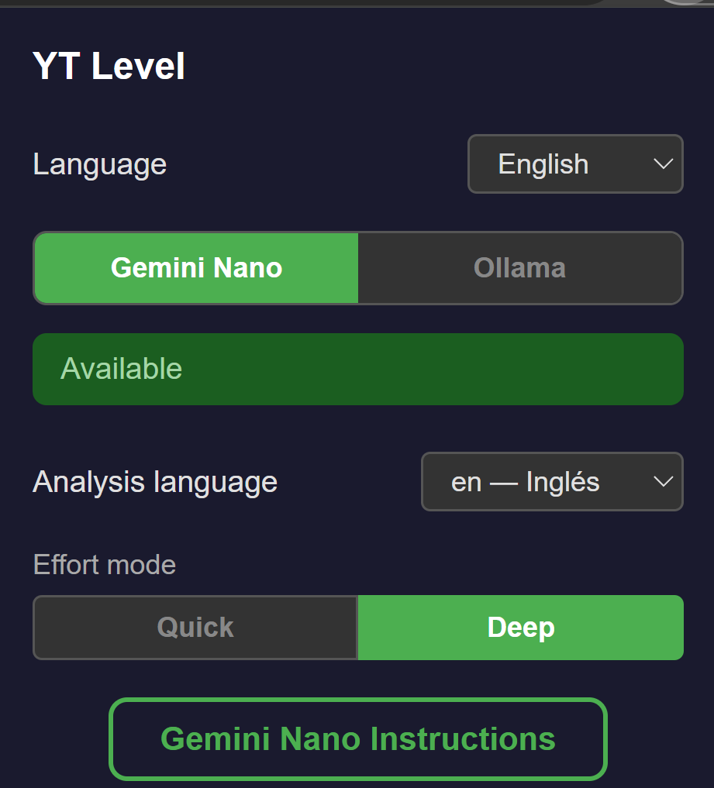
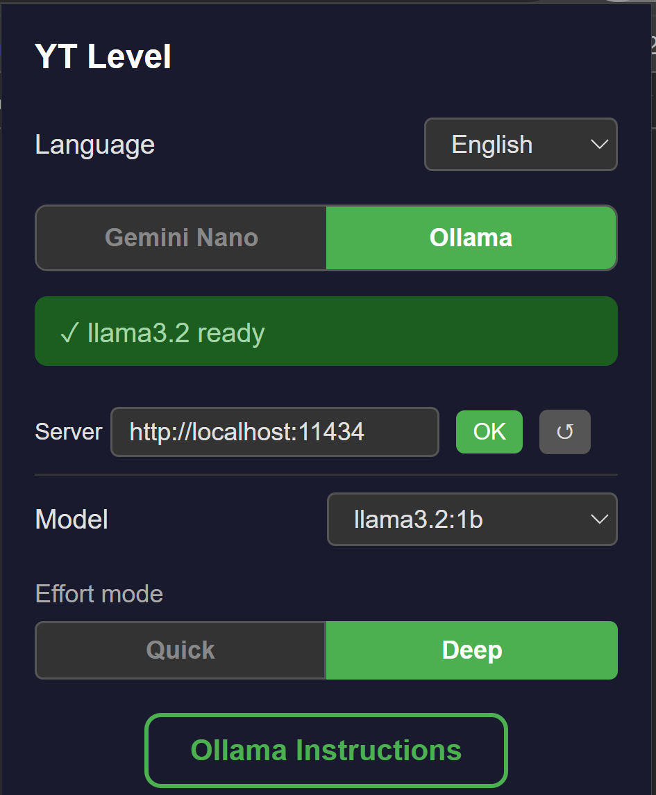

<div align="center">
  
  <h1>YT Level</h1>
  <p><strong>YouTube Language Level Analyzer</strong></p>
  <p>ローカル AI を使用して YouTube 動画の CEFR レベル（A1～C2）を分析 — API キーもインターネットも不要。</p>
  <p><strong>Gemini Nano</strong>（Chrome に組み込み）または <strong>Ollama</strong>（ローカルサーバー）の 2 つの AI エンジンから選択可能。<strong>あらゆる言語</strong>に対応。</p>
</div>

---

**🌐 言語**

[🇬🇧 English](README.md) · [🇪🇸 Español](README.es.md) · [🇫🇷 Français](README.fr.md) · [🇵🇹 Português](README.pt.md) · [🇩🇪 Deutsch](README.de.md) · [🇮🇹 Italiano](README.it.md) · [🇨🇳 中文](README.zh.md) · [🇯🇵 日本語](README.ja.md) · [🇰🇷 한국어](README.ko.md) · [🇸🇦 العربية](README.ar.md) · [🇮🇳 हिन्दी](README.hi.md) · [🇷🇺 Русский](README.ru.md)

---

## インストール

<div align="center">
  <a href="#" style="display:inline-block;padding:12px 32px;background:#4CAF50;color:#fff;border-radius:8px;text-decoration:none;font-weight:bold;font-size:16px;">Chrome Web Store で入手</a>
</div>

> インストール後、拡張機能は YouTube で自動的に動作します。拡張機能のアイコンをクリックして設定してください。

---

## スクリーンショット

<p align="center">
  
  <br>
  <em>YouTube サムネイルに表示される CEFR レベルバッジ（A1～C2）</em>
</p>

<p align="center">
  
  <br>
  <em>Screenshot 3</em>
</p>

<p align="center">
  
  <br>
  <em>Screenshot 4</em>
</p>

---

## 機能

- 🏷️ **CEFR バッジ** — YouTube 動画サムネイルに色付きの円（A1～C2）を表示
- 🤖 **2 つの AI エンジン** — **Gemini Nano**（Chrome 組み込み AI）または **Ollama**（ローカルモデル）を使用
- 🌍 **多言語対応** — あらゆる言語の動画を分析
- 🎨 **カスタム Ollama サーバー** — ネットワーク上の任意の Ollama インスタンスを指定可能
- ⚡ **高速キャッシュ** — 結果をローカルにキャッシュして再分析を防止
- 🔒 **100% プライベート** — すべてローカルで実行、データは外部に送信されません

---

## 必要条件

- **Chrome 128+**、**Brave**、または Chromium ベースのブラウザ
- **Gemini Nano**：Prompt API が有効な Chrome 128+
- **Ollama**：Ollama がインストールされ実行中であること（[ollama.com](https://ollama.com)）、かつ少なくとも 1 つのモデルがダウンロード済みであること

---

## Gemini Nano

Gemini Nano は Chrome に組み込まれた AI モデルです。ダウンロードやサーバーは不要です。

### 1. Prompt API フラグを有効化

1. **`chrome://flags/#prompt-api-for-gemini-nano`** を開く
2. フラグを **「Enabled」** に設定
3. **「Relaunch」** をクリックして Chrome を再起動

### 2. モデルのステータスを確認

YT Level のポップアップを開き、**Gemini Nano** タブを選択：

| ステータス | 意味 |
|--------|---------|
| **Available** | 使用可能 |
| **Downloading** | モデルをダウンロード中 |
| **Downloadable** | ダウンロードが必要 |
| **Unavailable** | お使いのブラウザでは非対応 |

### 3. 分析言語を選択

分析する動画の言語を選択：

| コード | 言語 |
|------|----------|
| en | 英語 |
| es | スペイン語 |
| ja | 日本語 |
| de | ドイツ語 |
| fr | フランス語 |

### 4. effort モードを選択

- **Quick** — シンプルなプロンプトで高速分類
- **Deep** — 詳細なプロンプトで包括的な CEFR 評価

---

## Ollama

### 1. Ollama をインストール

**Linux / macOS：**
```bash
curl -fsSL https://ollama.com/install.sh | sh
```

**Windows：**
[ollama.com/download](https://ollama.com/download) からインストーラーをダウンロードして実行。

### 2. モデルをダウンロード

```bash
ollama pull gemma3:1b
```

> 任意のモデルを使用できます。拡張機能のポップアップの Ollama タブから選択してください。

### 3. CORS を設定

拡張機能が YouTube から Ollama と通信するための権限が必要です。

#### Linux — Systemd（永続的）

```bash
sudo mkdir -p /etc/systemd/system/ollama.service.d
echo '[Service]
Environment=OLLAMA_ORIGINS=*' | sudo tee /etc/systemd/system/ollama.service.d/override.conf
sudo systemctl daemon-reload
sudo systemctl restart ollama
```

#### Linux — 一時的

```bash
sudo systemctl stop ollama
OLLAMA_ORIGINS=* ollama serve
```

#### Windows — 永続的

1. **システムのプロパティ** → **環境変数** を開く
2. 新しい **システム変数** を追加：`OLLAMA_ORIGINS` = `*`
3. **OK** をクリックし、Ollama を再起動

#### Windows — 一時的（PowerShell）

```powershell
$env:OLLAMA_ORIGINS="*"
ollama serve
```

### 4. 拡張機能で設定

1. 拡張機能アイコンをクリック
2. **Ollama** タブを選択
3. サーバー URL を設定（デフォルト：`http://localhost:11434`）
4. **OK** をクリックして接続をテスト
5. ドロップダウンからモデルを選択

---

## 拡張機能の使用方法

1. **https://www.youtube.com** にアクセス
2. 文字起こしがある動画は、分析中に緑色のスピナーが表示されます
3. 色付きの円とともにレベルが表示されます：**A1**、**A2**、**B1**、**B2**、**C1**、**C2**
4. バッジにカーソルを合わせると、使用されたエンジンとモデルが表示されます
5. 拡張機能アイコンをクリックしてポップアップを開き、エンジンを切り替えます

---

## 仕組み

1. YouTube フィードから各動画 ID を抽出
2. `youtube-transcript.ai` を介して文字起こしを取得
3. 文字起こしを選択した AI エンジン（Gemini Nano または Ollama）に送信し、CEFR 分類をリクエスト
4. 結果を動画サムネイルに円形バッジとして表示
5. 結果をローカルにキャッシュして再分析を防止

---

## カスタム Ollama サーバー

デフォルトでは拡張機能は `http://localhost:11434` に接続します。変更するには：

1. 拡張機能のポップアップを開く
2. **Ollama** タブを選択
3. サーバー URL を入力（例：`http://192.168.1.100:11434`）
4. **OK** をクリック — 拡張機能が接続をテストし、利用可能なモデルを読み込みます

---

<div align="center">
  <sub>API キーやインターネット接続は不要。すべてのデータはローカルに保持されます。</sub>
</div>
