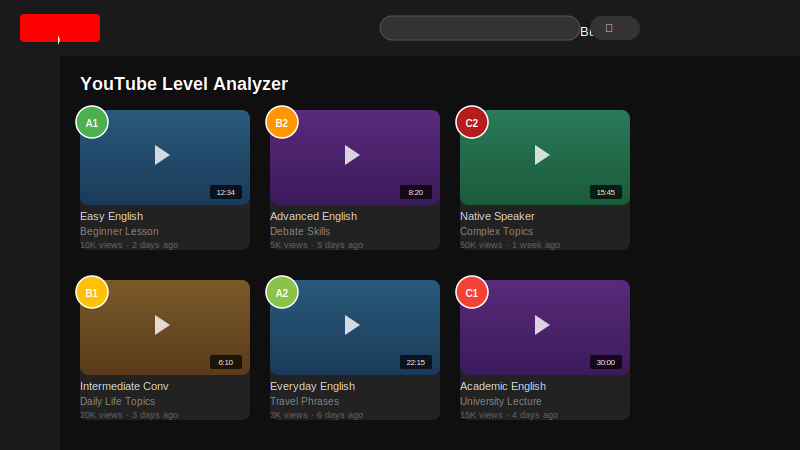
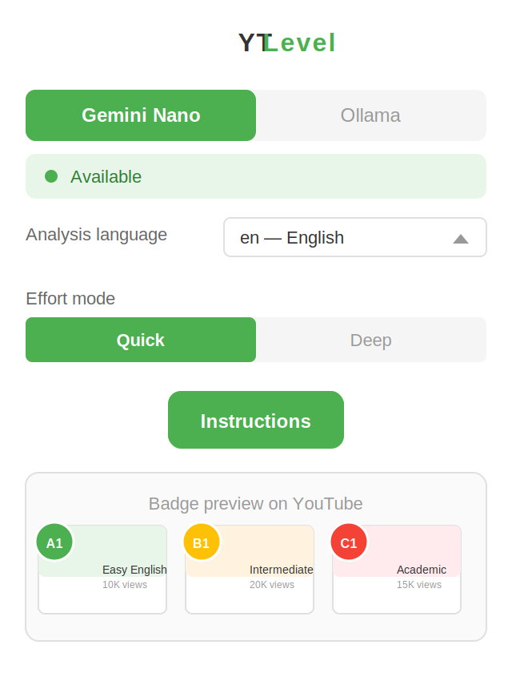

# YT Level — Анализатор уровня языка YouTube

**Анализируйте уровень CEFR (A1–C2) любого видео на YouTube с помощью локального ИИ — без API-ключей, без интернета.**

Работает для **любого языка** (английский, испанский, французский, немецкий, китайский и т.д.). Расширение получает транскрипцию видео и отправляет её локальной модели Ollama для классификации CEFR. На каждой миниатюре видео появляется цветной значок.

<p align="center">
  
</p>

---

**🌐 Язык**

[🇬🇧 English](README.md) · [🇪🇸 Español](README.es.md) · [🇫🇷 Français](README.fr.md) · [🇵🇹 Português](README.pt.md) · [🇩🇪 Deutsch](README.de.md) · [🇮🇹 Italiano](README.it.md) · [🇨🇳 中文](README.zh.md) · [🇯🇵 日本語](README.ja.md) · [🇰🇷 한국어](README.ko.md) · [🇸🇦 العربية](README.ar.md) · [🇮🇳 हिन्दी](README.hi.md) · [🇷🇺 Русский](README.ru.md)

---

## Скриншоты

<p align="center">
  
  <br>
  <em>Значки уровня CEFR (A1–C2) на миниатюрах YouTube</em>
</p>

<p align="center">
  
  <br>
  <em>Окно настройки — сервер, модель и язык</em>
</p>

## Возможности

- 🏷️ **Значки CEFR** — цветные кружки (A1–C2) на миниатюрах видео YouTube
- 🤖 **Локальный ИИ** — работает с любой моделью Ollama (gemma, llama, mistral и т.д.)
- 🌍 **Многоязычность** — анализирует видео на любом языке
- 🎨 **Свой сервер** — укажите любой экземпляр Ollama в вашей сети
- ⚡ **Быстрый кеш** — результаты сохраняются локально, исключая повторный анализ
- 🔒 **100% приватность** — всё работает локально, данные не покидают ваше устройство

## Требования

- **Chrome 128+**, **Brave** или любой браузер на Chromium
- Установленный и запущенный **Ollama** ([ollama.com](https://ollama.com))
- Как минимум **одна загруженная модель Ollama** (например `ollama pull gemma3:1b`)

## Установка — по шагам

### 1. Установите Ollama

**Linux / macOS:**
```bash
curl -fsSL https://ollama.com/install.sh | sh
```

**Windows:**
Скачайте установщик с [ollama.com/download](https://ollama.com/download) и запустите его. Ollama автоматически запустится как фоновый сервис.

### 2. Загрузите модель

Откройте терминал (командную строку в Windows) и выполните:

```bash
ollama pull gemma3:1b
```

> Вы можете использовать любую модель. Расширение позволяет выбрать нужную из всплывающего окна.

### 3. Настройте CORS в Ollama

Расширению нужно разрешение на общение с Ollama с сайта YouTube.

#### Linux — Вариант A: Systemd (постоянный, рекомендуется)

```bash
sudo mkdir -p /etc/systemd/system/ollama.service.d

echo '[Service]
Environment=OLLAMA_ORIGINS=*' | sudo tee /etc/systemd/system/ollama.service.d/override.conf

sudo systemctl daemon-reload
sudo systemctl restart ollama
```

#### Linux — Вариант B: Вручную (временно)

```bash
sudo systemctl stop ollama
OLLAMA_ORIGINS=* ollama serve
```

#### Windows — Вариант A: Постоянный (рекомендуется)

1. Откройте Свойства системы → Переменные среды
2. Добавьте новую системную переменную:
   - Имя: `OLLAMA_ORIGINS`
   - Значение: `*`
3. Нажмите OK и перезапустите Ollama из системного трея (правый клик → Выйти, затем запустите снова)

#### Windows — Вариант B: Временный (командная строка)

```cmd
set OLLAMA_ORIGINS=*
ollama serve
```

> В Windows запускайте эти команды после закрытия Ollama из системного трея.

### 4. Загрузите расширение в браузер

1. Перейдите на **`chrome://extensions`** (или **`brave://extensions`**)
2. Включите **«Режим разработчика»** (правый верхний угол)
3. Нажмите **«Загрузить распакованное»**
4. Выберите папку проекта

### 5. Разрешите права (ВАЖНО)

Некоторые браузеры требуют явных разрешений для работы расширения:

1. На странице `chrome://extensions` нажмите **«Подробнее»** на **YT Level**
2. Включите **«Разрешить этому расширению читать и изменять все ваши данные на посещаемых сайтах»**
3. При появлении запроса нажмите **«Разрешить»**

> Без этого шага расширение загрузится, но не будет работать на страницах YouTube.

### 6. Используйте расширение

1. Перейдите на **https://www.youtube.com**
2. У видео с транскрипцией отображается зелёный индикатор во время анализа
3. Появляется цветной кружок с уровнем: **A1**, **A2**, **B1**, **B2**, **C1** или **C2**
4. Наведите курсор на значок, чтобы увидеть, какая модель использовалась
5. Нажмите на иконку расширения, чтобы открыть всплывающее окно:
   - **Сервер** — измените URL вашего сервера Ollama при необходимости
   - **Модель** — выберите, какую установленную модель использовать
   - **Язык** — измените язык интерфейса расширения

## Как это работает

1. Извлекает ID каждого видео из ленты YouTube
2. Получает транскрипцию через `youtube-transcript.ai`
3. Отправляет транскрипцию вашей локальной модели Ollama с запросом классификации CEFR
4. Отображает результат в виде цветного значка на миниатюре видео
5. Результаты сохраняются локально в кеше

## Свой сервер Ollama

По умолчанию расширение подключается к `http://localhost:11434`. Вы можете это изменить:

1. Нажмите на иконку расширения
2. Введите URL вашего сервера (например `http://192.168.1.100:11434`)
3. Нажмите **OK** — расширение проверит подключение и загрузит доступные модели
4. Нажмите **↺** для сброса на значение по умолчанию

## Структура файлов

```
├── manifest.json      Конфигурация расширения
├── content.js         Основной скрипт (внедряется в YouTube)
├── background.js      Service worker
├── popup.html         Всплывающее окно
├── popup.js           Логика всплывающего окна
├── styles.css         Дополнительные стили
├── analyzer.js        Эвристический анализатор (запасной)
├── icons/             Иконки расширения
└── README.ru.md       Этот файл
```

## Примечания

- Анализируются только видео, **имеющие транскрипцию** на YouTube
- Время анализа зависит от вашего оборудования и размера модели (20–60 секунд на видео на CPU)
- Если Ollama не запущен или модель не установлена, значки не отображаются
- Не требуется API-ключ или подключение к интернету (после загрузки модели)
- Все данные остаются локальными — ничего не отправляется на внешние серверы
